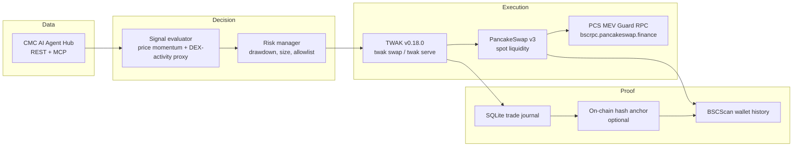

# CascadeFade — System Architecture

> **Track 1: Autonomous Trading Agents** | BNB Hack: AI Trading Agent Edition
> *Buy the calm. Sell the crowd.*
> Trading window: **June 22 – 28, 2026**.

---

## 1. System Overview

CascadeFade is a **spot-only, autonomous BSC trading agent** for BNB Hack Track 1. It reads market data from the CoinMarketCap AI Agent Hub, decides via a simple rule-based signal, executes non-custodial swaps through the Trust Wallet Agent Kit (TWAK), and records a local trade journal that can be anchored to BSC for tamper-evident auditing. The final, verifiable PnL ground truth is the **registered TWAK wallet's BSC transaction history** on BSCScan.

The design is reduced to a minimal spot-only agent that satisfies the hard competition constraints and maximizes the three special-prize scoring surfaces.

### Principles

1. **Spot-only** — TWAK supports `twak swap` and ERC-20 transfers, but no perp or short CLI/MCP primitive exists, and the official 149-token allowlist is a BEP-20 spot universe. All short/reversion exposure is expressed as *flat* or *stablecoin rotation* (USDT → BNB, BNB → stablecoin, etc.).
2. **Non-custodial throughout** — The TWAK wallet is created locally; the AI agent never holds the mnemonic. Signing is handled by the TWAK CLI or `twak serve` MCP on the same machine.
3. **Hard constraints first** — A daily heartbeat trade guarantees at least one qualified trade per day. A 25% portfolio-level drawdown stop keeps the agent well below the official ~30% max-drawdown risk gate. Only tokens from the official 149-token allowlist are traded.
4. **Evidence-backed claims** — All cited URLs, addresses, and mechanisms are drawn from the multi-source audit reports in `$M/audit/`.

### Architecture diagram



The system is a single Python 3.11+ asyncio process. Docker, Redis, dashboard, and backtester are excluded from the core build.

---

## 2. Scope & Boundaries

### In scope

- Single spot-only strategy based on data that is **actually available** from CMC.
- TWAK `swap` / `twak serve` MCP as the execution surface.
- PancakeSwap v3 spot liquidity via TWAK's routing (and, optionally, a direct QuoterV2 check for slippage sanity).
- MEV-protected submission through the official PancakeSwap MEV Guard RPC.
- SQLite trade journal plus BSCScan as the PnL source of truth.
- ERC-8004 agent identity for the BNB AI Agent SDK special prize.
- Hardcoded 149-token competition allowlist.
- Daily heartbeat trade to satisfy the 7-trade minimum.
- 25% portfolio drawdown hard stop and position-size guardrails.

### Out of scope (explicitly dropped from the original docs)

| Dropped item | Reason |
|--------------|--------|
| Perps (Aster / Orderly / PancakeSwap Perps) | TWAK does not expose perp signing; both require extra on-chain/auth layers outside TWAK's native surface. |
| Two-regime design (CascadeFade + Hype-Exhaustion) | CMC does not provide per-token social volume or liquidation series. The redesign uses only CMC prices, DEX-activity proxies, and optional derivatives regime data. |
| ERC-8183 as a PnL ledger | ERC-8183 is an agentic-commerce/escrow protocol, not a trade ledger. Using it for PnL is a category error. |
| Redis / PostgreSQL / Docker / VPS dashboard | SQLite and a single process are sufficient. |
| FastAPI live dashboard | Does not affect competition score; replaced by SQLite + a local chart script. |
| Full backtest harness | Historical data is not available on the free CMC tier; signals use hardcoded thresholds. |
| 14-day phased plan | Deadline is roughly 24 hours away. |

---

## 3. Data Layer

All data comes from the **CoinMarketCap AI Agent Hub**. The official CMC MCP has 12 tools; the runtime agent uses a small subset of REST or MCP endpoints that are either free or cheap, and only polls them at a coarse cadence.

### Selected data sources

| What we need | Verified CMC source | Availability | Why we use it |
|---|---|---|---|
| Prices and momentum | `get_crypto_quotes_latest` or `/v3/cryptocurrency/quotes/latest` | Free/Basic | Per-token price, 24h/7d percent change, volume. Used to detect low-attention positive drift. |
| DEX activity / liquidity proxy | `/v1/dex/tokens/transactions` or `/v4/dex/pairs/quotes/latest` | Trial/Basic | On-chain transaction count and volume as a proxy for social/attention that CMC does not expose per-token. |
| Trending / attention exit | `/v1/dex/tokens/trending/list` or CMC MCP `trending_crypto_narratives` | DEX trending free; community trending Standard+ | Exit signal: a held token entering the CMC DEX trending list or a narrative heat-up. |
| Derivatives regime filter | CMC v5 derivatives endpoints or `get_global_crypto_derivatives_metrics` | Free/Basic | Global OI and funding as a risk-on/risk-off filter; not used for per-token liquidation cascades. |
| Fear & Greed | `/v3/fear-and-greed/latest` | Basic | Global risk backdrop. Avoid deploying new risk during extreme fear unless the signal is very strong. |

### x402 self-funding (optional demo only)

- The CMC x402 pay-per-request endpoint requires **USDC on Base** (`0x833589fCD6eDb6E08f4c7C32D4f71b54bdA02913`), not BNB. The agent uses a free CMC API key for live trading; one x402-paid call can be demonstrated to score the TWAK x402 points.
- MCP endpoint: `https://mcp.coinmarketcap.com/mcp`. x402 endpoint: `https://mcp.coinmarketcap.com/x402/mcp`.

---

## 4. Decision Layer

The decision layer is intentionally simple: a single rule set evaluated on a fixed interval, plus hardcoded risk guardrails. No regime switch, no perps, no complex volatility scaling.

### The spot signal

Name: **Low-Attention Momentum Fade (spot-only)**.

The agent buys tokens that are rising but not yet on the CMC DEX trending list, and sells when they enter the top 3. DEX volume is an optional secondary filter because CMC does not provide per-token social media counts.

**Buy condition (all must be true):**
1. Token is in the hardcoded 149-token competition allowlist.
2. 7-day price change > 0 (positive drift), derived from CMC `get_crypto_quotes_latest` / `percent_change_7d`.
3. Token is not currently in the top 3 of the CMC DEX trending list (the proxy for "attention").
4. Token is not already held (max 2 concurrent positions).
5. Global Fear & Greed is not at the "Extreme Fear" cutoff, or the signal is overridden by a derivatives risk-off flag.
6. Slippage estimate from QuoterV2 / market quote is < 1%.

**Optional low-attention filter:** 24-hour volume below its own 3-day rolling median. If DEX data is missing, stale, or sparse, the agent falls back to the momentum + not-trending condition alone.

**Sell condition (any one true):**
1. Token enters the top 3 of the CMC DEX trending list (attention peak).
2. 24-hour volume spikes above a 3-day median by more than a configured multiple (optional; only used if DEX volume data is available).
3. Per-trade stop-loss of -5% from entry is hit.
4. Per-trade take-profit of +10% is hit.
5. Hard portfolio drawdown stop requires closing all positions.

**Daily heartbeat trade:** If no natural trade has occurred in 22 hours, the agent performs a tiny qualifying swap (e.g., $5 USDT → BNB) within the 149-token list. This guarantees the official ≥1 trade/day requirement.

### Risk manager

| Parameter | Value | Rationale |
|---|---|---|
| **Hard portfolio drawdown stop** | **25%** | The official rules say a "max drawdown cap" risk gate (e.g., ~30%). 25% gives a safety margin. |
| **Per-trade stop-loss** | 5% from entry | Keeps single-trade losses small. |
| **Per-trade take-profit** | 10% from entry | Captures momentum, then rotates. |
| **Max concurrent positions** | 2 | Prevents over-concentration while keeping the heartbeat simple. |
| **Max exposure per trade** | 10% of portfolio | No single trade can approach the disqualification threshold. |
| **Min trade size for heartbeat** | $5 | Ensures the on-chain transaction counts as a real trade without risking material drawdown. |
| **Portfolio floor** | Stop trading if total portfolio < $10 | The official floor is $1; $10 gives a buffer for gas and slippage. |
| **Allowlist enforcement** | Reject any token not in the 149-token list | Trades outside the list do not count toward the competition. |
| **Max slippage** | 1% | Skip the trade if the route cannot deliver this. MEV Guard RPC is the primary execution route. |
| **Time-based exits** | 48-hour max hold | If no attention or stop event occurs, close the position to refresh capital and avoid stale exposure. |

### Position sizing

- Fixed fraction of portfolio: 10% per trade, capped at the current cash balance.
- No volatility scaling; 7-day volatility is already indirectly filtered by the 7-day momentum and low-attention condition.
- The heartbeat trade uses a fixed small dollar amount (e.g., $5) and is intentionally not volatility-scaled.

---

## 5. Execution Layer

### TWAK as the single execution surface

TWAK v0.18.0 (`@trustwallet/cli`) is the official execution layer. The agent uses it via the CLI or the `twak serve` MCP/REST interface, not via a third-party SDK. The project does **not** use `twak start crypto` as a CLI command; that phrase is BNB Hack campaign shorthand, not a documented runtime primitive. The documented execution surface is:

- **Primary:** `twak swap <amount> <from> <to> --chain bsc --slippage <pct>` invoked as a direct CLI subprocess from the Python agent.
- **Optional:** `twak serve` (stdio or REST) for MCP-style integration, where the agent can call the same wallet actions over a local transport.
- **Note:** `twak serve --watch` is intended for DCA/limit automations, not as a generic background daemon for the full signal loop.

### Developer-defined policy

- Daily spend cap: enforced both in the agent's Python code and via TWAK's per-command flags (`--max-usd` / slippage limits) where available.
- Asset allowlist: the 149-token competition list, hardcoded.
- No external transfers: the agent only swaps between tokens and stablecoins in the allowlist.
- The wallet mnemonic is encrypted in `~/.twak/wallet.json`; the password is supplied via the `TWAK_WALLET_PASSWORD` environment variable or the OS keychain.

### PancakeSwap v3 + MEV-protected RPC

The agent routes all BSC transactions through the official **PancakeSwap MEV Guard** RPC endpoint:

```
https://bscrpc.pancakeswap.finance
Chain ID: 56
Currency: BNB
```

This is the canonical, free RPC from the official PancakeSwap docs. The earlier `https://mev-protect.pancakeswap.com` URL was an error in the web research and must not be used. MEV Guard reduces sandwich and frontrunning risk but does not guarantee zero MEV loss.

Key verified contract addresses (BSC mainnet):

| Contract | Address | Purpose |
|---|---|---|
| PancakeSwap V3 Smart Router | `0x13f4EA83D0bd40E75C8222255bc855a974568Dd4` | Route discovery across v2/v3/stable pools. |
| PancakeSwap V3 QuoterV2 | `0xB048Bbc1Ee6b733FFfCFb9e9CeF7375518e25997` | Slippage estimate for a single V3 pool. |
| PancakeSwap V3 SwapRouter | `0x1b81D678ffb9C0263b24A97847620C99d213eB14` | Direct single-pool swap if the Smart Router path is unavailable. |
| WBNB | `0xbb4CdB9CBd36B01bD1cBaEBF2De08d9173bc095c` | Native BNB wrapper. |
| BNB Hack competition registration | `0x212c61b9b72c95d95bf29cf032f5e5635629aed5` | On-chain agent registration. |
| ERC-8004 identity registry (BSC mainnet) | `0x8004A169FB4a3325136EB29fA0ceB6D2e539a432` | BNB AI Agent SDK identity. |

### Execution fallback path

1. **Primary:** `twak swap ... --chain bsc` submitted via the MEV Guard RPC configured in the wallet/agent config.
2. **Slippage sanity check:** Before any swap, call PancakeSwap QuoterV2 or `twak swap --quote-only` to verify the output is within the 1% slippage cap. If not, the trade is rejected.
3. **Direct Smart Router fallback:** If TWAK's route is unavailable, the agent can compose an `exactInputSingle` call to the V3 SwapRouter and ask TWAK to sign it via `twak wallet sign` or its MCP equivalent. Only used if the primary path fails.

---

## 6. Logging & Proof Layer

### On-chain PnL (source of truth)

The official hackathon evaluates **real on-chain total return**. The canonical proof is the **registered TWAK wallet's transaction history on BSCScan**. The agent's `twak compete register` call records this wallet address in the competition contract, so the PnL can be independently verified by judges.

### Local trade journal (audit trail)

Every decision and trade is recorded in a local SQLite database with the following fields:

- `timestamp` (UTC)
- `signal` (rule name, e.g., "low-attention-momentum")
- `token_in`, `token_out`
- `amount_in`, `amount_out`, and prices at entry and exit
- `slippage_estimate`
- `tx_hash`
- `signal_snapshot` (JSON blob of the CMC data used at decision time)
- `realized_pnl` and `running_portfolio_value`

This journal provides the narrative link between the CMC data and the on-chain transaction hashes.

### Optional on-chain hash anchor

For tamper-evident auditing, the agent can periodically compute a `keccak256` hash of the journal and publish it as the `data` field of a self-transfer transaction (or via a tiny custom memo contract). This is **not** presented as a PnL ledger; it is an integrity anchor that lets anyone prove the journal has not been altered since the hash was posted.

---

## 7. Risk Management & Safety

### Portfolio-level guardrails

The risk manager table above defines the hard stop. Additional rules:
- A **25% drawdown** closes all positions and halts trading.
- A **$10 portfolio floor** stops new trades (far above the official $1 floor).
- Near the floor, only the minimal heartbeat trade runs to remain qualified.

### Execution safety

- **Slippage cap:** 1% maximum per trade; rejected if exceeded.
- **RPC failure:** If the MEV Guard RPC fails, the agent logs the error and retries once after a short delay. It does not submit to a public mempool when the protected RPC is unavailable unless the operator explicitly overrides.
- **API failure:** If CMC data is stale (>30 minutes) or unreachable, the agent does not enter new positions; it only manages existing positions or performs the heartbeat.
- **Kill switch:** A manual `kill.json` flag or env var triggers immediate market close of all positions.

### Token risk

- Only the official 149 BEP-20 tokens may be traded. Any token requested by the signal that is not in the list is rejected immediately.
- Stablecoin pairs (USDT/BUSD) are preferred for the heartbeat trade to minimize price risk.

---

## 8. Deployment Model

### Runtime

- Single Python 3.11+ asyncio process, running in a `tmux`/`screen` session or as a systemd service.
- No Docker, no docker-compose, no Redis.
- The process can be run locally or on a low-cost cloud VM. There is no requirement for a public dashboard.

### Startup sequence

1. Set environment variables: `CMC_API_KEY`, `TWAK_WALLET_PASSWORD`, `TWAK_ACCESS_ID`, `TWAK_HMAC_SECRET`, optional `BNB_RPC_URL`.
2. Install `twak` CLI ≥ 0.18.0.
3. Fund the TWAK wallet with BNB for gas and USDT for trading.
4. Run `twak compete register` before the trading window opens.
5. Start the agent: `python -m src.agent` or `./run.sh`.
6. Verify the first heartbeat trade on BSCScan.

### Configuration file (`config.toml` / `.env`)

- `CMC_API_KEY` or `CMC_MCP_API_KEY`
- `TWAK_WALLET_PASSWORD`, `TWAK_ACCESS_ID`, `TWAK_HMAC_SECRET`
- `BNB_RPC_URL` (defaults to `https://bscrpc.pancakeswap.finance`)
- `TRADE_INTERVAL_MINUTES`
- `MAX_POSITIONS`, `MAX_POSITION_PCT`, `STOP_LOSS_PCT`, `TAKE_PROFIT_PCT`, `MAX_DRAWDOWN_PCT`, `HEARTBEAT_SIZE_USD`, `MAX_SLIPPAGE_PCT`
- Path to the 149-token allowlist JSON

---

## 9. Tech Stack

| Tool / Library | Version / Source | Purpose |
|---|---|---|
| Python | 3.11+ | Core runtime |
| `web3.py` | 6.x | Direct contract reads if needed; optional fallback execution |
| `aiohttp` | 3.x | Async CMC REST client |
| `sqlite3` | stdlib | Trade journal + lightweight cache |
| `twak` / `@trustwallet/cli` | 0.18.0 | Non-custodial wallet, swaps, x402, competition registration |
| `bnbagent` (optional) | latest | ERC-8004 identity registration |
| CMC AI Agent Hub | REST + MCP | Price, trending, DEX activity, derivatives regime, Fear & Greed |
| PancakeSwap MEV Guard RPC | `https://bscrpc.pancakeswap.finance` | MEV-protected transaction submission |
| PancakeSwap v3 Smart Router / QuoterV2 | On-chain BSC | Route and slippage checks |

---

## 10. Special Prize Alignment

### Best Use of Trust Wallet Agent Kit ($2,000)

The execution layer runs entirely on TWAK (`twak swap`, `twak serve`, `twak compete register`, `twak x402 request`), satisfying the scoring criteria for integration depth, self-custody integrity, autonomous execution, and optional x402 usage.

### Best Use of CoinMarketCap AI Agent Hub ($2,000)

The agent reads CMC via REST/MCP for price, DEX activity, and trending signals, with an optional x402 micropayment demonstration.

### Best Use of BNB AI Agent SDK ($2,000)

The agent registers an **ERC-8004 identity** on BSC (mainnet or testnet via MegaFuel). **ERC-8183 is not used as a PnL ledger** — the wallet's BSCScan history is the canonical PnL proof.

---

## 11. Evidence Appendix

| Claim | Source | URL / Reference |
|---|---|---|
| Submission deadline June 21, 12:00 UTC | DoraHacks tracks | `https://dorahacks.io/hackathon/bnbhack-twt-cmc/tracks` |
| Trading window June 22–28, 149-token allowlist, ≥1 trade/day, ~30% max drawdown cap, $1 floor | DoraHacks detail | `https://dorahacks.io/hackathon/bnbhack-twt-cmc/detail` |
| TWAK v0.18.0, `twak swap`, `twak serve`, no perp command | Trust Wallet CLI docs | `https://developer.trustwallet.com/developer/agent-sdk/cli-reference` |
| TWAK x402 uses USDC on Base | CMC x402 docs | `https://coinmarketcap.com/api/documentation/ai-agent-hub/x402` |
| ERC-8183 is agentic commerce/escrow, not PnL ledger | EIP-8183 | `https://eips.ethereum.org/EIPS/eip-8183` |
| ERC-8004 identity registry | EIP-8004 + BNBAgent SDK | `https://eips.ethereum.org/EIPS/eip-8004`, `https://github.com/bnb-chain/bnbagent-sdk` |
| Competition registration contract | DoraHacks detail | `0x212c61b9b72c95d95bf29cf032f5e5635629aed5` |
| PancakeSwap MEV Guard RPC | PancakeSwap docs | `https://docs.pancakeswap.finance/trading-tools/pancakeswap-mev-guard` |
| PancakeSwap v3 contract addresses | PancakeSwap dev docs | `https://developer.pancakeswap.finance/contracts/v3/addresses` |
| CMC has no per-token social-volume/liquidation history | CMC API docs | `https://coinmarketcap.com/api/documentation/ai-agent-hub/mcp` |
| MegaFuel gas-free registration is testnet-only | BNB Chain docs | `https://docs.bnbchain.org/bnb-smart-chain/developers/paymaster/overview/` |

---

*Architecture claims are cross-checked against `$M/audit/`. No ERC-8183 PnL ledger, no perps, no BNB x402, no unsupported MEV RPC URLs.*
